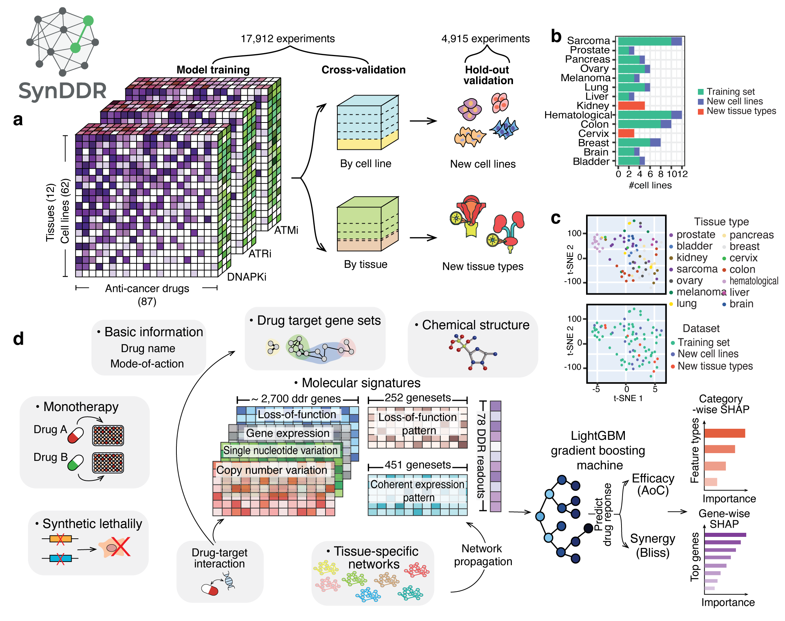
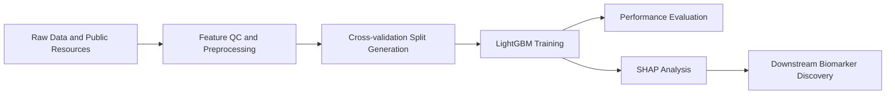

# SynDDR

<p align="center">
  <strong>A Systematic Platform for Benchmarking DNA Damage Response Combination Therapy Predictions</strong>
</p>

<p align="center">
  <a href="https://www.python.org/"></a>
  <a href="https://lightgbm.readthedocs.io/"></a>
  
</p>

SynDDR is a machine-learning framework for predicting DDR drug-combination efficacy and synergy. The core model is based on LightGBM and integrates multi-modal biological and pharmacological features.



## Table of Contents

- [Overview](#overview)
- [SynDDR Shiny App](#synddr-shiny-app)
- [Feature Space](#feature-space)
- [Dependencies](#dependencies)
- [Data Sources](#data-sources)
- [Repository Structure](#repository-structure)
- [Quick Start](#quick-start)
- [Training and SHAP Analysis](#training-and-shap-analysis)
- [Downstream Analysis](#downstream-analysis)
- [Result Summarization](#result-summarization)
- [Post Analysis](#post-analysis)
- [Reference](#reference)

## Overview

SynDDR supports end-to-end workflows from feature preparation to training, interpretation, and post-hoc biological analysis.

## SynDDR Shiny App

Interactive web app for SynDDR:

- https://github.com/GuanLab/DDR-drug-synergy-prediction-ShinyApp


## Feature Space

The model uses the following feature groups:

- Basic drug information: drug name and mode of action
- Monotherapy experiment efficacy score (AoC)
- Drug chemical structure
- Molecular signatures: CNV, SNV, EXP, LOF signatures of about 2,700 DDR genes, coherent/LOF patterns of gene sets, and 78 DDR signatures
- Drug-target interactions
- Tissue-specific gene networks
- Synthetic lethality

## Dependencies

Install dependencies with:

```bash
pip install -r requirements.txt
```

Pinned dependencies in [requirements.txt](requirements.txt):

| Package | Version |
|---|---|
| chembl_webresource_client | 0.10.4 |
| lightgbm | 3.1.1 |
| matplotlib | 3.3.4 |
| networkx | 2.5.1 |
| numpy | 1.19.5 |
| openbabel | 3.2.0 |
| pandas | 1.1.5 |
| PubChemPy | 1.0.4 |
| pybel | 0.15.5 |
| rdkit | 2026.3.3 |
| scikit_learn | 1.9.0 |
| scipy | 1.5.4 |
| seaborn | 0.11.2 |
| shap | 0.35.0 |
| tqdm | 4.31.1 |

## Data Sources

- LINCS: https://lincs.hms.harvard.edu/db/datasets/20000/results?search=&output_type=.csv
- DGIdb: https://dgidb.org/downloads
- HumanBase (tissue-specific networks): [https://hb.flatironinstitute.org](https://hb.flatironinstitute.org)
- SynLethDB 2.0 (synthetic lethality): [https://synlethdb.sist.shanghaitech.edu.cn/v2/](https://synlethdb.sist.shanghaitech.edu.cn/v2/)
- DDR High Throughput Screening datasets from OSF:
  - DDR combination treatment responses and dose-response matrix: https://osf.io/8hbsx/
  - Molecular signatures: https://osf.io/8mxgj/

## Repository Structure

```text
.
|-- feature/
|   |-- chemical_structure_features/
|   |-- data/
|   |-- QC/
|   |   |-- QC.py
|   |   |-- QC_visualization.ipynb
|   |   |-- pull_drug_target.py
|   |   `-- split_train_test.py
|   `-- tissue_specific_networks/
|-- master/
|   `-- master_code/
|       |-- main.py
|       |-- build_feature_dataset.py
|       |-- common.py
|       |-- models.py
|       |-- shap_analysis.py
|       |-- utils.py
|       `-- downstream_analysis/
|-- molecular_analysis/
|   |-- ATRi_monotherpay_top_genes.py
|   `-- gene_interaction_synergy.py
|-- result_summary/
|   |-- calculate_efficacy.ipynb
|   |-- generate_surrogate_model.ipynb
|   |-- result_summary.py
|   |-- tissue-specific_results.py
|   `-- utils.py
|-- bash.sh
|-- bash_holdout.sh
|-- bash_mol.sh
|-- bash_shap.sh
|-- bash_test.sh
|-- bash_topgenes.sh
`-- bash_topsynleth.sh
```

## Quick Start

### 1) Prepare data and features

```bash
cd feature/QC
python QC.py
```

This stage generates and validates feature files, including geneset, molecular, response, and target-gene related outputs.

### 2) Build train/test splits

```bash
cd feature/QC
python split_train_test.py
```

This creates split directories such as:

- `test_by_cell_line/fold_*/{Train.tsv,Test.tsv}`
- `test_by_cell_line/hold_out_validation/Test.tsv`
- `test_by_indication/fold_*/{Train.tsv,Test.tsv}`
- `test_by_indication/hold_out_validation/Test_*.tsv`

### 3) Train and evaluate

```bash
cd master/master_code
python main.py --help
```

Example run:

```bash
python main.py -p test_by_cell_line -s aoc
```

## Training and SHAP Analysis

The main training entrypoint is `master/master_code/main.py`.

Core capabilities:

- Train synergy prediction models for AoC (efficacy) and Bliss (synergy)
- Evaluate across cross-validation and hold-out settings
- Generate SHAP feature importance analysis
- Support subset-specific SHAP analyses (for example by mode-of-action, cell line, or tissue)

Sample launcher scripts are available at the repository root:

- `bash.sh`
- `bash_holdout.sh`
- `bash_mol.sh`
- `bash_shap.sh`
- `bash_topgenes.sh`
- `bash_topsynleth.sh`

## Downstream Analysis

After SHAP generation, run downstream statistical analysis:

```bash
cd master/master_code/downstream_analysis
python statistical_analysis.py
```

This includes:

- SHAP analysis by feature category
- DDR gene importance by molecular modality (CNV, SNV, LOF, EXP)
- Tissue-specific DDR feature interpretation

## Result Summarization

Use `result_summary/` for consolidated reporting:

- `calculate_efficacy.ipynb`: treatment prioritization compared with baseline treatment
- `generate_surrogate_model.ipynb`: surrogate model feature generation from full-model SHAP
- `result_summary.py`: summarize cross-validation and hold-out performance
- `tissue-specific_results.py`: tissue-wise performance summaries
- `utils.py`: helper utilities for summarization

## Post Analysis

Additional molecular interpretation scripts are in `molecular_analysis/`:

- `gene_interaction_synergy.py`: top interacting genes with core DDR targets (ATR, ATM, DNAPK) for efficacy and synergy
- `ATRi_monotherpay_top_genes.py`: genes positively and negatively correlated with efficacy in ATRi monotherapy

## Reference

TBD


